# Zeek + Zui SOC Traffic Analysis (PCAP) — 2025-01-22

This project walks through a practical SOC-style workflow using **Zeek logs in Zui** to triage and investigate a suspicious PCAP. The goal was to quickly answer:

- What happened during the capture window?
- Which internal host is the likely victim?
- What external infrastructure (domains/IPs) is involved?
- What evidence supports the suspicion (DNS/HTTP/SSL + detections)?

---

## Lab Safety / Setup

To safely handle malware-training PCAPs:

1. **Snapshot** the Ubuntu VM
2. **Disable clipboard + drag/drop + shared folders**
3. Set VM networking to a controlled mode for downloading (ex: **NAT/LAN**)
4. Download a dataset from *malware-traffic-analysis.net* training exercises
	* Link: https://www.malware-traffic-analysis.net/2025/01/22/index.html
5. Switch networking to **No Network** before analysis

---

## Dataset & Case Files

The PCAP used in this case:

- `2025-01-22-traffic-analysis-exercise.pcap`

Placed into the case directory:

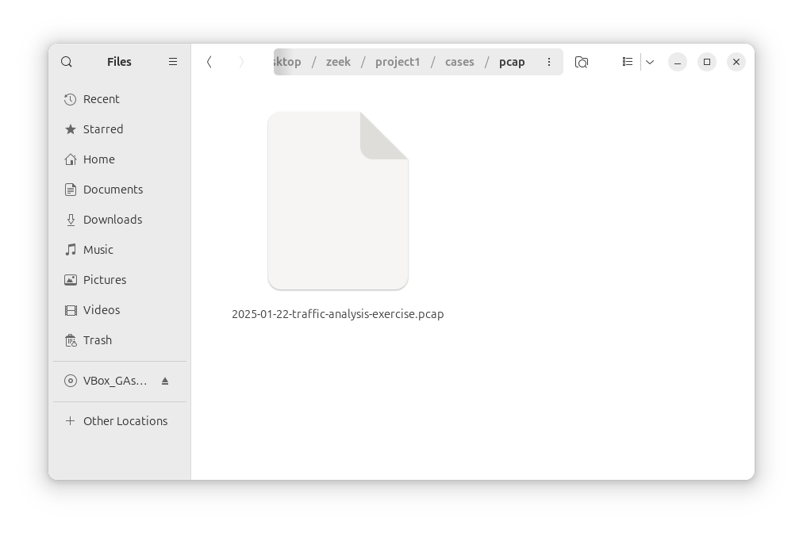

---

## Load PCAP in Zui

1. Open **Zui**
2. Create/select a pool
3. Click **Load Data** and import the PCAP

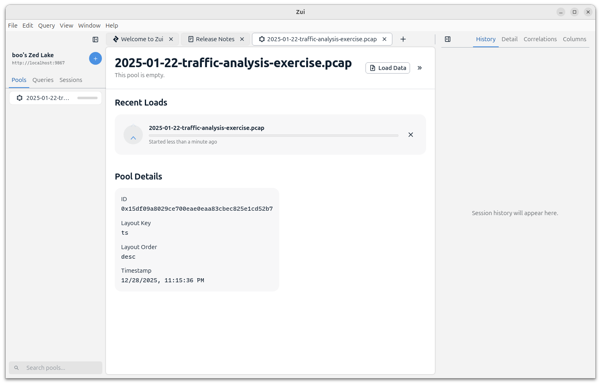

Once loaded, confirm events are present by opening a query session:

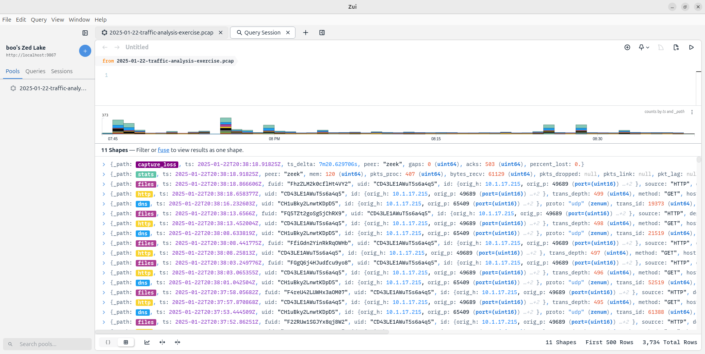

---

## Step 1 — Identify Available Logs (What Zeek Parsed)

First, check what log “paths” exist and which are most active:

```zui
count() by _path | sort count desc
````

Result highlights:

* `conn` (connections) and `dns` dominate
* Strong presence of `http`, `files`, `ssl`
* Alerts are present (from `event_type=="alert"`)


---

## Step 2 — Find the Top Internal Talker (Likely Victim)

Pivot to connection logs and count by source (origin) IP:

```zui
_path=="conn" | count() by id.orig_h | sort count desc | head 20
```

Top talker:

* **10.1.17.215** with **854** connections (massively higher than anything else)

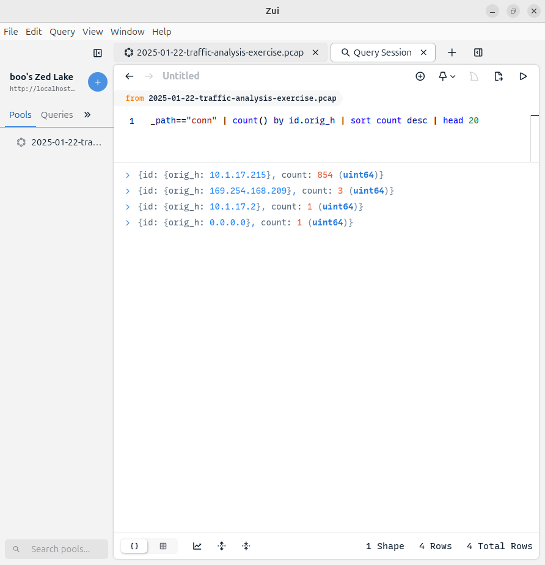

**Working assumption:** `10.1.17.215` is the likely infected workstation.

---

## Step 3 — Identify Top Destinations (Where the Victim Talks To)

Count destination IPs across all connections:

```zui
_path=="conn" | count() by id.resp_h | sort count desc | head 20
```

Notable destinations include:

* **10.1.17.2** (highest volume; likely internal DNS/gateway)
* Broadcast/multicast noise (`10.1.17.255`, `224.0.0.251`, `239.255.255.250`)
* Multiple external IPs worth pivoting into

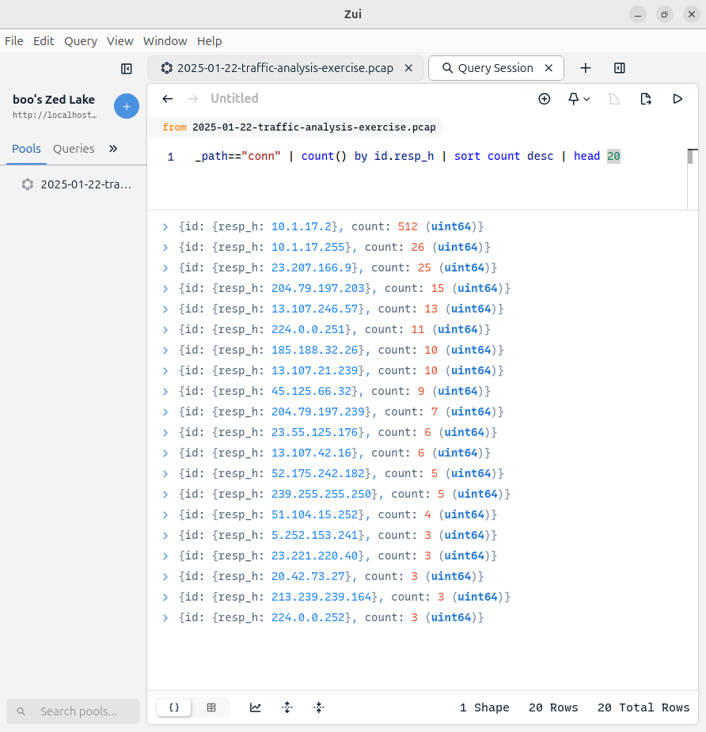

Now filter specifically to the suspected victim:

```zui
_path=="conn" and id.orig_h==10.1.17.215
| count() by id.resp_h
| sort count desc
```

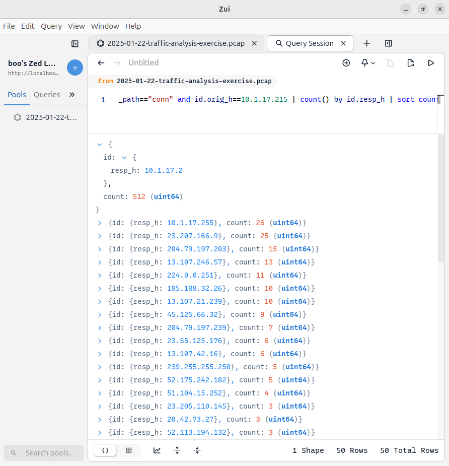

---

## Step 4 — Determine the Time Window

Start time:

```zui
sort ts | head 1
```


End time:

```zui
sort ts desc | head 1
```

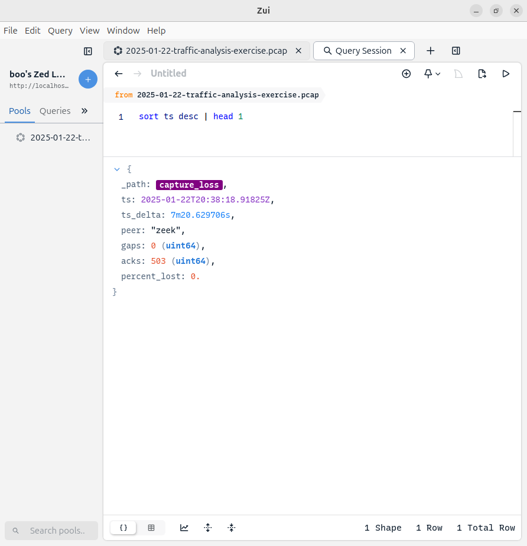

Capture window is roughly **19:44:56Z → 20:38:18Z** (about ~53 minutes).

---

## Step 5 — DNS Triage (Suspicious Lookups)

Check what domains the victim requested most:

```zui
_path=="dns" and id.orig_h==10.1.17.215
| count() by query
| sort count desc
| head 50
```

Key findings:

* **ping3.dymgate.com** appears at very high frequency (beacon-like)
* `wpad.*` also appears (proxy auto-discovery; often abused/misconfigured)
* Normal background domains exist too (e.g., Bing)

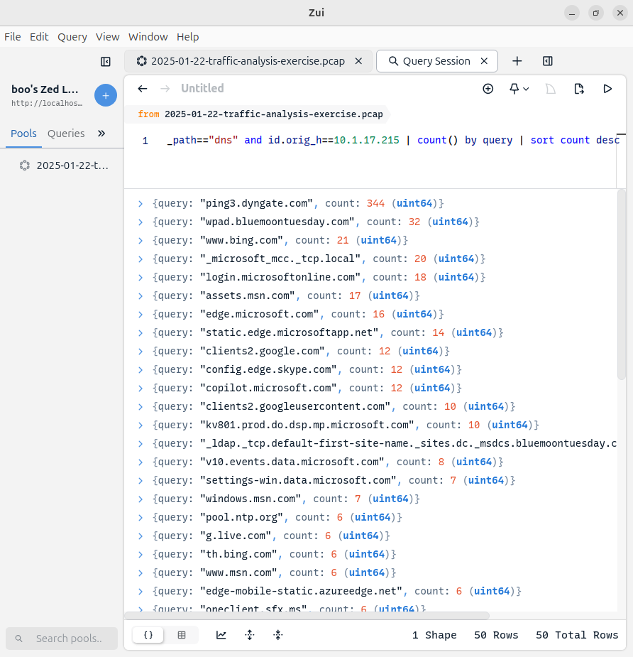

---

## Step 6 — HTTP Deep Dive (High-Signal Evidence)

### 6.1 — Which HTTP hosts are contacted most?

```zui
_path=="http" and id.orig_h==10.1.17.215
| count() by host
| sort count desc
| head 50
```

High-signal result:

* **5.252.153.241** dominates victim HTTP traffic

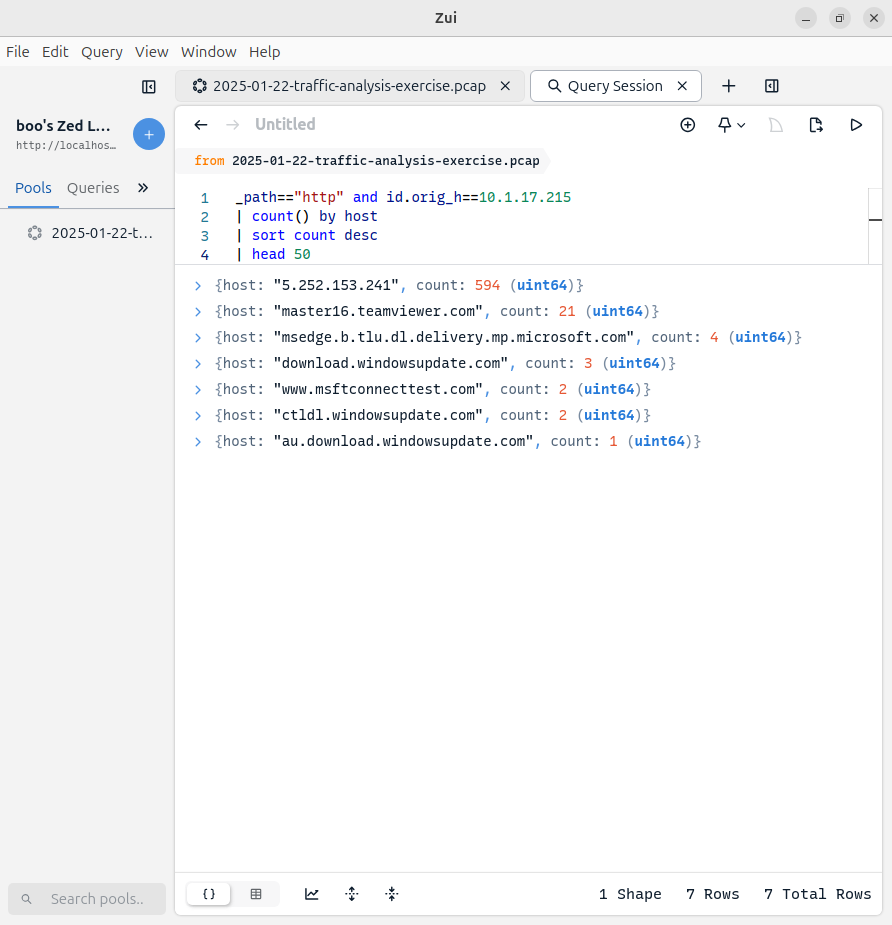

### 6.2 — What URIs were requested from the suspicious host?

```zui
_path=="http" and id.orig_h==10.1.17.215
| count() by host, uri
| sort count desc
| head 50
```

This showed repeated requests to a single URI (beacon-like), plus file pulls that look like scripts/resources.

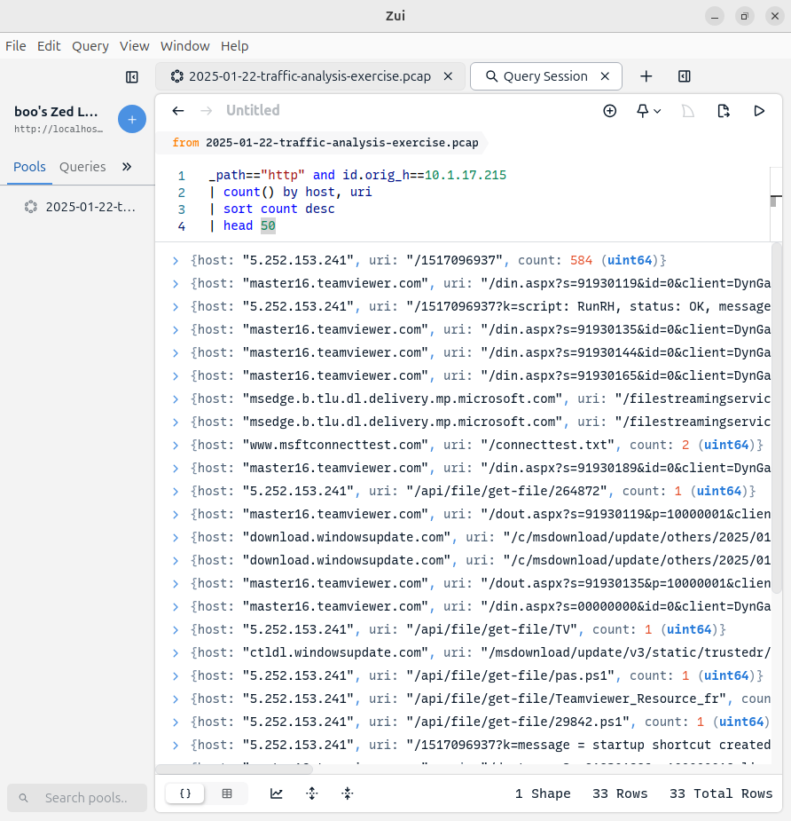

Focusing only on the suspicious host:

```zui
_path=="http" and id.orig_h==10.1.17.215 and host=="5.252.153.241"
| count() by method, uri
| sort count desc
| head 50
```

Notable artifacts observed:

* Repeated `GET /1517096937` (very high count)
* Requests consistent with fetching `.ps1` scripts and “TeamViewer” resources

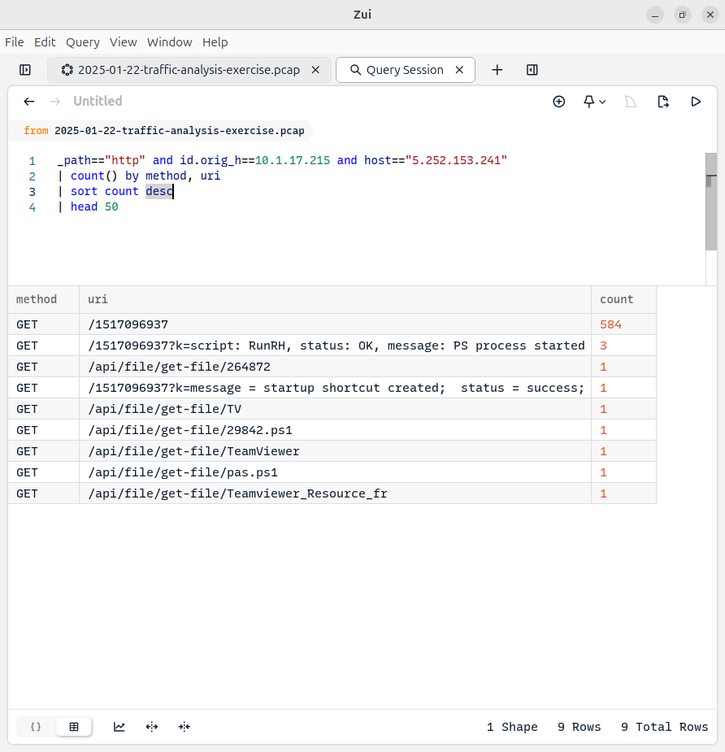

### 6.3 — HTTP response codes

```zui
_path=="http" and id.orig_h==10.1.17.215 and host=="5.252.153.241"
| count() by status_code
| sort count desc
```

Observed pattern:

* Many responses are **404** with a smaller number of **200**
* This is consistent with beaconing / staged responses / probing behavior


### 6.4 — User-Agent analysis

```zui
_path=="http" and id.orig_h==10.1.17.215
| count() by user_agent
| sort count desc
| head 50
```

A standout UA includes **DynGate** (commonly seen in malicious traffic emulation/training sets), plus BITS / Windows update agents.

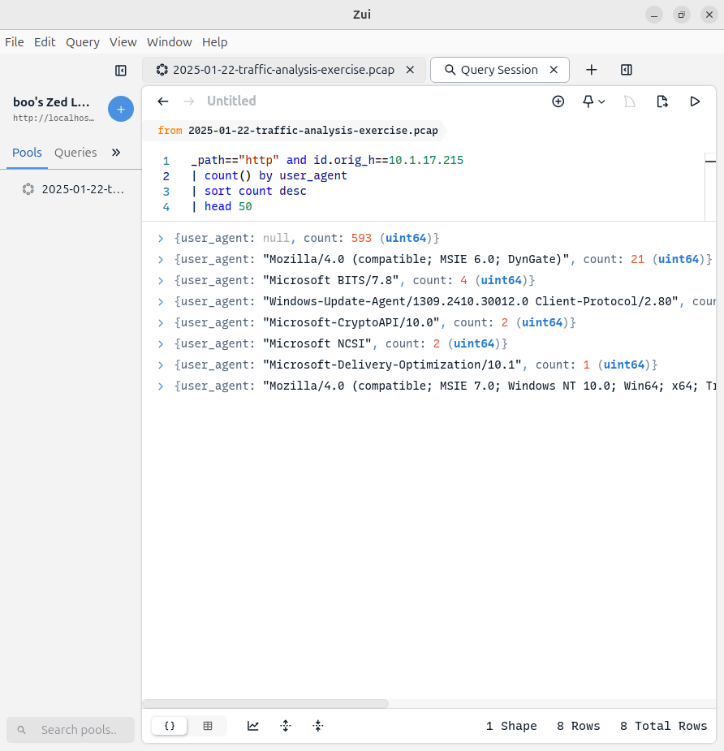

User-agent scoped to the suspicious host:

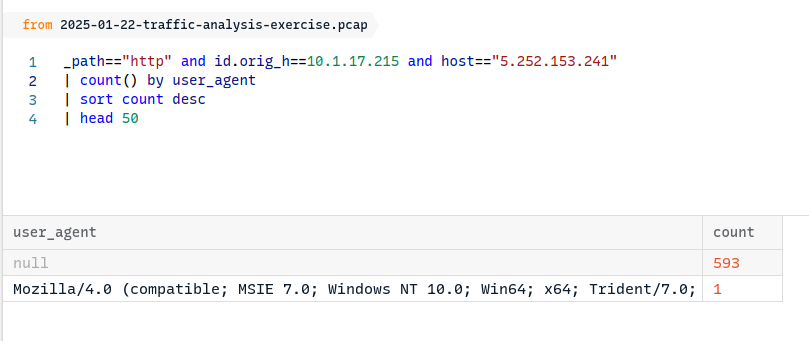

---

## Step 7 — Validate With Detections (Alerts)

This dataset included alert events (ex: Suricata-style records). Summarize signatures:

```zui
event_type=="alert"
| count() by alert.signature
| sort count desc
| head 50
```

Highlights included signatures consistent with:

* Minimal-header EXE retrieval (potential second stage)
* Suspicious “dotted quad host” MZ response
* PowerShell stager / download behavior
* TeamViewer + DynGate indicators
* “Fake Microsoft Teams” themed malware detections (training set context)

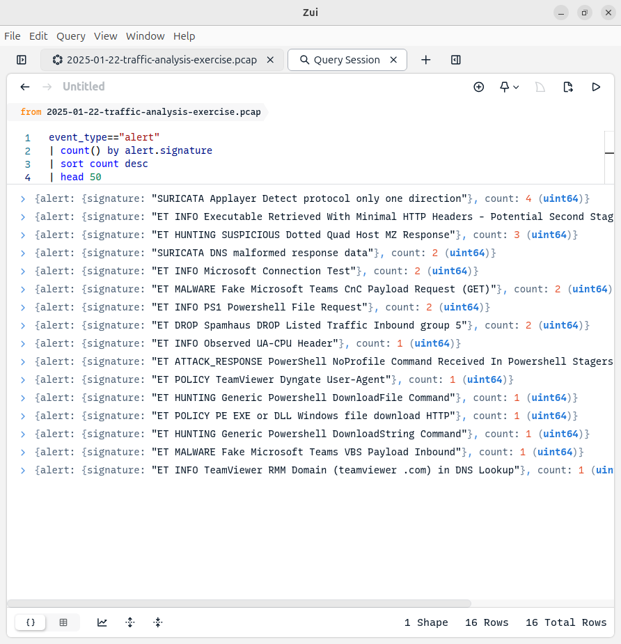

---

## Step 8 — Connection Context for Key Peers

### 8.1 — Victim → internal DNS/gateway (10.1.17.2)

```zui
_path=="conn" and id.orig_h==10.1.17.215 and id.resp_h==10.1.17.2
| count() by id.resp_p, service, proto
| sort count desc
| head 20
```

Confirms heavy UDP/53 DNS activity to **10.1.17.2**.

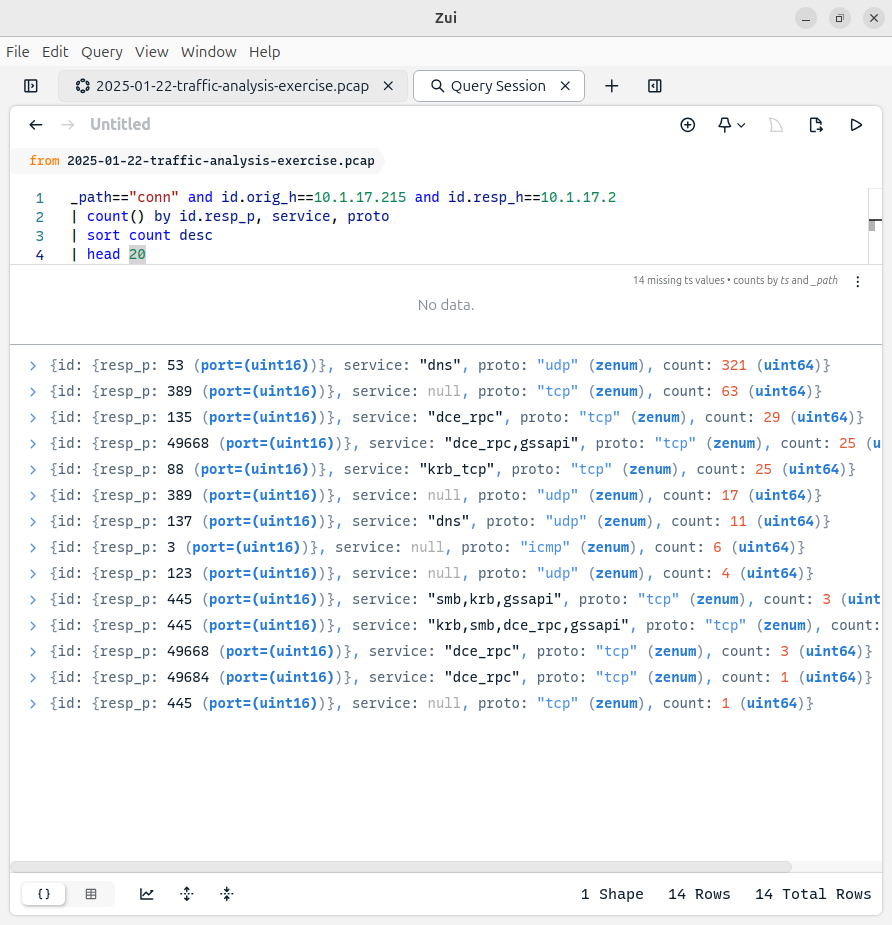

DNS server perspective:

```zui
_path=="dns" and id.resp_h==10.1.17.2
| count() by id.orig_h
| sort count desc
| head 20
```

Shows the victim is the dominant DNS client.

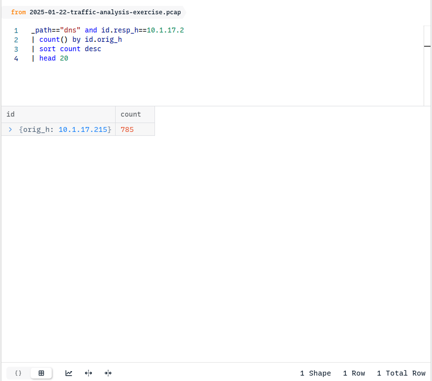

### 8.2 — Victim → suspicious external IP (5.252.153.241)

```zui
_path=="conn" and id.orig_h==10.1.17.215 and id.resp_h==5.252.153.241
| count() by id.resp_p, service, proto
| sort count desc
```

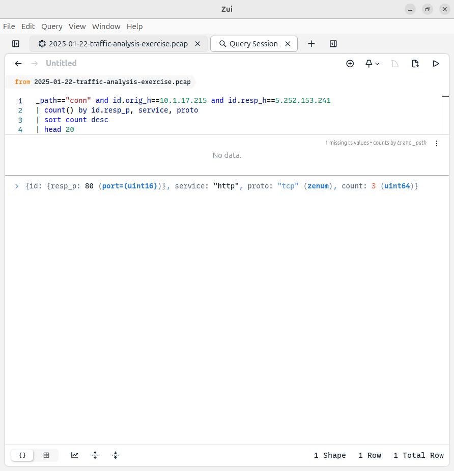

Time-bucket the connections:

```zui
_path=="conn" and id.orig_h==10.1.17.215 and id.resp_h==5.252.153.241
| count() by bucket(ts, 1m)
| sort bucket(ts, 1m)
```

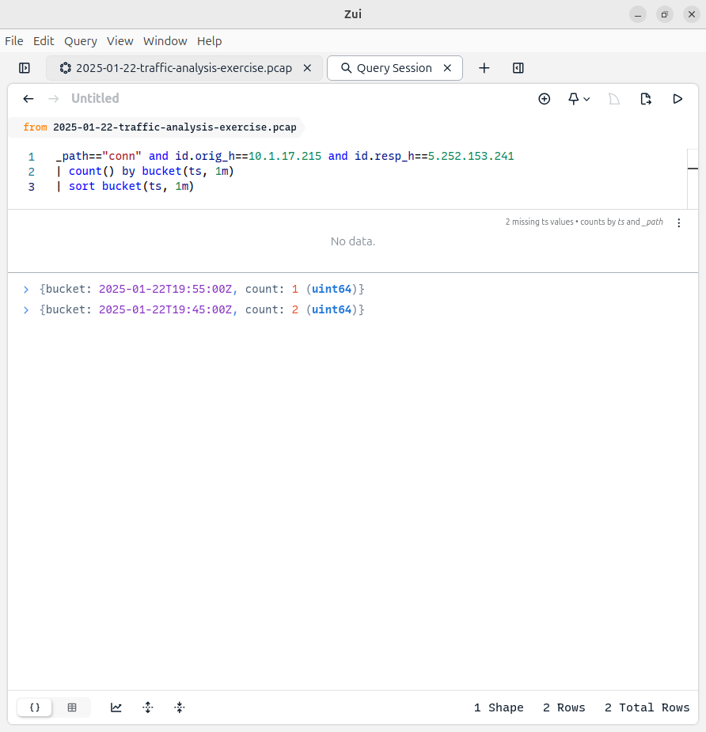

---

## Optional Pivot — TeamViewer Domain Resolution + Follow-on Traffic

DNS answer for `master16.teamviewer.com`:

```zui
_path=="dns" and id.orig_h==10.1.17.215 and query=="master16.teamviewer.com"
| sort ts
| cut ts, id.orig_h, id.resp_h, query, qtype_name, rcode_name, answers
```

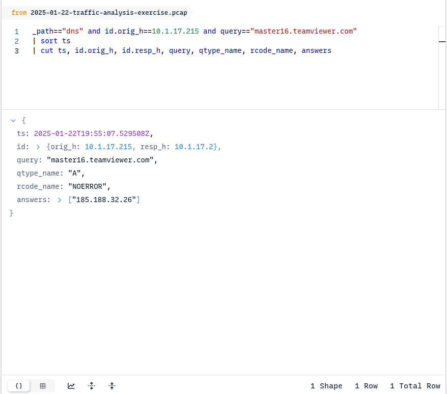

Follow the resolved IP:

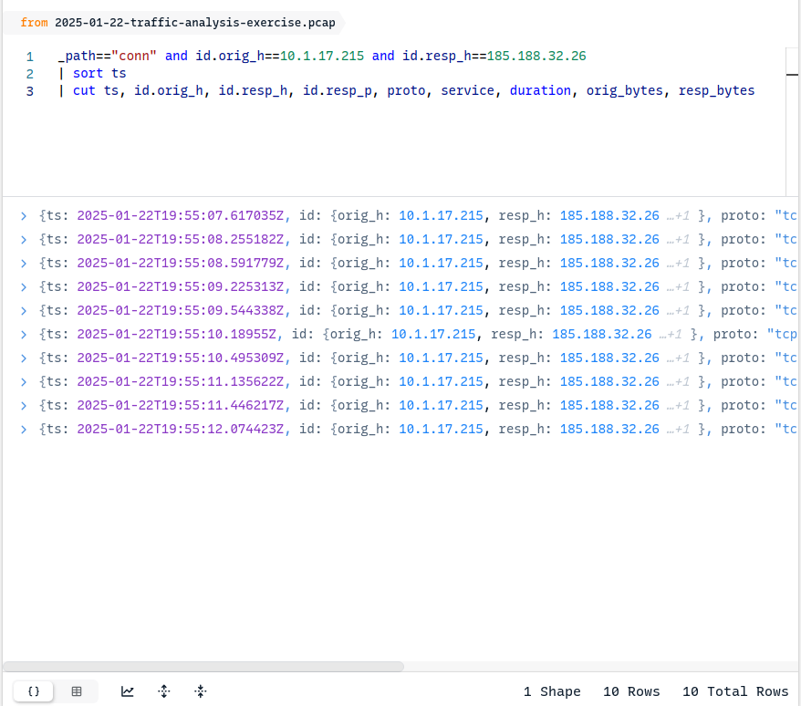

---

## Findings Summary

### Likely Victim

* **10.1.17.215** generated the overwhelming majority of activity.

### High-Confidence Suspicious Indicators

* Repeated DNS lookups to **ping3.dymgate.com** (beacon-like frequency)
* Heavy HTTP traffic to **5.252.153.241**, including repeated URI patterns and script/resource pulls
* User-agent evidence includes **DynGate**
* Alert signatures strongly align with staged download + PowerShell behavior and “Fake Microsoft Teams” themed malware (training set)

---

## Extracted IOCs (From This Investigation)

**Internal Host**

* `10.1.17.215`

**Suspicious Domains**

* `ping3.dymgate.com`
* `wpad.bluemontuesday.com` (suspicious in context / worth validation)
* `master16.teamviewer.com` (context-dependent; can be legitimate but appears in this scenario)

**Suspicious IPs (high signal in this dataset)**

* `5.252.153.241`
* `45.125.66.32`
* `185.188.32.26` (resolved from TeamViewer domain in this capture)

---

## What I’d Do Next (If This Were a Real Incident)

* Pull `files` + `http` logs to extract filenames/hashes and recover payloads (if available)
* Confirm process execution chain on the endpoint (EDR / Sysmon)
* Block IOCs at DNS/proxy/firewall and hunt across environment for:

  * `ping3.dymgate.com`
  * `5.252.153.241`
  * DynGate user-agent patterns
* Validate persistence indicators suggested by HTTP responses (startup shortcut / PowerShell activity)

---

## Skills Demonstrated

* Zeek log triage (`conn`, `dns`, `http`, `ssl`, `files`)
* Zui querying (grouping, sorting, filtering, time bucketing)
* Victim identification (“top talker” methodology)
* IOC extraction + timeline validation
* Corroboration using alert telemetry
